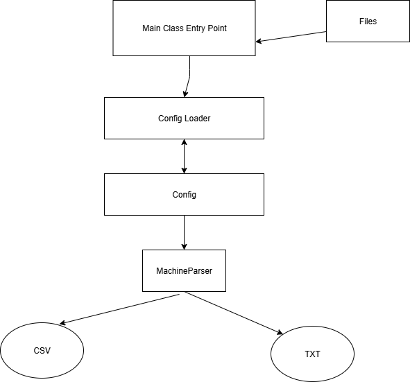

MachineData

Requirements
Java 21 (JDK) or above

Easy lo launch like a regular Java app via Main class.
In src/resources there are two files to process, both of them are 'Machine'. The 1st one is in csv format, the 2nd is in txt format.

In order to select the file to process, within src/resources/machine-config.properties switch csv to txt or vice versa.

